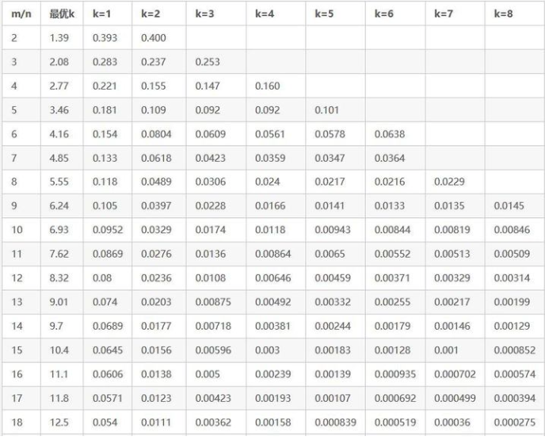

### 功能介绍
Tensorflow对Embedding的支持是通过Variable实现的。其中，用于存储Embedding的Variable大小为[vocabulary_size, embedding_dimension]，需要事先确定。在大规模稀疏特征的场景中，会有以下弊端：

1. vocabulary_size一般由id空间决定，在线学习场景中，新id不断加入导致vocabulary_size难估计；
1. id一般为string类型且规模庞大，进行Embedding之前需要先Hash到vocabulary_size范围内：
   - vocabulary_size过小，会导致Hash冲撞率增加，不同特征可能查到相同的Embedding，即特征减少；
   - vocabulary_size过大，会导致Variable内部存储了永远不会被到查到的Embedding，即内存冗余；
3. Embedding变量过大是模型变大的主要原因，即便通过正则手段使得某些特征的Embedding对整个模型效果影响不大，也无法把这些Emebdding从模型中去掉；


为解决上述问题，DeepRec新设计了一套支持动态Embedding语义的EmbeddingVariable，在特征无损训练的同时以最经济的方式使用内存资源，使得超大规模特征的模型更容易增量上线。
​

DeepRec的EmbeddingVariable经过了若干版本的迭代，在支持特征淘汰、特征准入、特征统计等基础功能的基础之上，进行了包括稀疏特征存储结构优化，无锁化hashmap，混合存储架构（gpu, mem, ssd），Embedding GPU算子支持、HashTable GPU存储等等的支持。当前TensorFlow recommenders-addons中提供了基础Embedding Variable功能的支持（[https://github.com/tensorflow/recommenders-addons/pull/16](https://github.com/tensorflow/recommenders-addons/pull/16)）。


### 用户接口
我们向用户提供两个层面的API，分别为embedding variable和feature_column
下面API是创建一个新的EmbeddingVariable变量
```python
def get_embedding_variable(name,
                           embedding_dim,
                           key_dtype=dtypes.int64,
                           value_dtype=None,
                           initializer=None,
                           regularizer=None,
                           trainable=True,
                           collections=None,
                           caching_device=None,
                           partitioner=None,
                           validate_shape=True,
                           custom_getter=None,
                           constraint=None,
                           init_data_source=None,
                           ev_option = tf.EmbeddingVariableOption()):
```

- `name`: EmbeddingVariable名称
- `embedding_dim`: embedding之后的维度, eg: 8, 64
- `key_dtype`: lookup时key的类型，默认值为int64，允许的值为int64和int32
- `value_dtype`: embedding vector的类型，目前仅限于float
- `initializer`: embedding vector初始化值，可以传入的参数为Initializer或list
- `trainable`: 是否被添加到GraphKeys.TRAINABLE_VARIABLES的collection
- `partitioner`: 分区函数
- `ev_opt`: 一些基于EV的功能参数配置

通过`tf.feature_column`使用Embedding Variable功能的API：
```python
def categorical_column_with_embedding(key,
                                  dtype=dtypes.string,
                                  partition_num=None,
                                  ev_option=tf.EmbeddingVariableOption()
                                  )
```
另外也可以通过`tf.contrib.feature_column`使用Embedding Variable功能
```python
def sparse_column_with_embedding(column_name,
                                 dtype=dtypes.string,
                                 partition_num=None,
                                 steps_to_live=None,
                                 init_data_source=None,
                                 ht_partition_num=1000,
                                 evconfig = variables.EmbeddingVariableOption()
```
### 功能使用示例
使用`get_embedding_variable`接口
```python
import tensorflow as tf

var = tf.get_embedding_variable("var_0",
                                embedding_dim=3,
                                initializer=tf.ones_initializer(tf.float32),
                                partitioner=tf.fixed_size_partitioner(num_shards=4))

shape = [var1.total_count() for var1 in var]

emb = tf.nn.embedding_lookup(var, tf.cast([0,1,2,5,6,7], tf.int64))
fun = tf.multiply(emb, 2.0, name='multiply')
loss = tf.reduce_sum(fun, name='reduce_sum')
opt = tf.train.AdagradOptimizer(0.1)

g_v = opt.compute_gradients(loss)
train_op = opt.apply_gradients(g_v)

init = tf.global_variables_initializer()

sess_config = tf.ConfigProto(allow_soft_placement=True, log_device_placement=False)
with tf.Session(config=sess_config) as sess:
  sess.run([init])
  print(sess.run([emb, train_op, loss]))
  print(sess.run([emb, train_op, loss]))
  print(sess.run([emb, train_op, loss]))
  print(sess.run([shape]))
```
使用`categorical_column_with_embedding`接口：
```python
import tensorflow as tf
from tensorflow.python.framework import ops


columns = tf.feature_column.categorical_column_with_embedding("col_emb", dtype=tf.dtypes.int64)
W = tf.feature_column.embedding_column(categorical_column=columns,
            dimension=3,
            initializer=tf.ones_initializer(tf.dtypes.float32))

ids={}
ids["col_emb"] = tf.SparseTensor(indices=[[0,0],[1,1],[2,2],[3,3],[4,4]], values=tf.cast([1,2,3,4,5], tf.dtypes.int64), dense_shape=[5, 4])

emb = tf.feature_column.input_layer(ids, [W])
fun = tf.multiply(emb, 2.0, name='multiply')
loss = tf.reduce_sum(fun, name='reduce_sum')
opt = tf.train.FtrlOptimizer(0.1, l1_regularization_strength=2.0, l2_regularization_strength=0.00001)
g_v = opt.compute_gradients(loss)
train_op = opt.apply_gradients(g_v)
init = tf.global_variables_initializer()

with tf.Session() as sess:
    sess.run(init)
    print("init global done")
    print(sess.run([emb, train_op,loss]))
    print(sess.run([emb, train_op,loss]))
    print(sess.run([emb, train_op,loss]))
```
使用`sparse_column_with_embedding`接口：
```python
import tensorflow as tf
from tensorflow.python.framework import ops
from tensorflow.contrib.layers.python.layers import feature_column_ops
from tensorflow.contrib.layers.python.layers import feature_column


columns = feature_column.sparse_column_with_embedding(column_name="col_emb", dtype=tf.dtypes.int64)
W = feature_column.embedding_column(sparse_id_column=columns,
            dimension=3,
            initializer=tf.ones_initializer(tf.dtypes.float32))

ids={}
ids["col_emb"] = tf.SparseTensor(indices=[[0,0],[1,1],[2,2],[3,3],[4,4]], values=tf.cast([1,2,3,4,5], tf.dtypes.int64), dense_shape=[5, 4])

emb = feature_column_ops.input_from_feature_columns(columns_to_tensors=ids, feature_columns=[W])
fun = tf.multiply(emb, 2.0, name='multiply')
loss = tf.reduce_sum(fun, name='reduce_sum')
opt = tf.train.FtrlOptimizer(0.1, l1_regularization_strength=2.0, l2_regularization_strength=0.00001)
g_v = opt.compute_gradients(loss)
train_op = opt.apply_gradients(g_v)
init = tf.global_variables_initializer()

with tf.Session() as sess:
    sess.run(init)
    print("init global done")
    print(sess.run([emb, train_op,loss]))
    print(sess.run([emb, train_op,loss]))
    print(sess.run([emb, train_op,loss]))
```
### Embedding Variable进阶功能
基于Embedding Variable，我们进一步开发了许多其他功能以减少内存占用、减少训练时间或推理延迟，或提高训练效果。这些功能的开关以及配置是通过`EmbeddingVariableOption`类控制的
```python
class EmbeddingVariableOption(object):
  def __init__(self,
               ht_type="",
               ht_partition_num = 1000,
               evict_option = None,
               filter_opiton = None):
```
具体的参数含义如下：

- `ht_type`: EmbeddingVariable底层使用的hash table的类型：目前支持的包括`dense_hash_map`以及`dense_hash_map_lockless`
- `ht_partition_num`: EmbeddingVariable底层使用的dense hash table的分片数量，分片主要是为了减少多线程带来的读写锁的开销。对于lockless hash map，分片数固定为1
- `evict_option`：用来配置特征淘汰功能的开关以及相关参数配置
- `filter_option`: 用来配置特征淘汰功能的开关以及相关参数配置


#### 1. 特征准入
通过观察发现，当有些特征的频率过低时，对模型的训练效果不会有帮助，还会造成内存浪费以及过拟合的问题。因此需要特征准入功能来过滤掉频率过低的特征。
目前我们支持了两种特征准入的方式：基于Counter的特征准入和基于Bloom Filter的特征准入：

- **基于Counter的特征准入：**基于Counter的准入会记录每个特征在前向中被访问的次数，只有当统计的次出超过准入值的特征才会给分配embedding vector并且在后向中被更新。这种方法的好处子在于会精确的统计每个特征的次数，同时获取频次的查询可以跟查询embedding vector同时完成，因此相比不使用特征准入的时候几乎不会带来额外的时间开销。缺点则是为了减少查询的次数，即使对于不准入的特征，也需要记录对应特征所有的metadata，在准入比例较低的时候相比使用Bloom Filter的方法会有较多额外内存开销。
- **基于Bloom Filter的准入**：基于Bloom Filter的准入是基于Counter Bloom Filter实现的，这种方法的优点是在准入比例较低的情况下，可以比较大地减少内存的使用量。缺点是由于需要多次hash与查询，会带来比较明显的时间开销，同时在准入比例较高的情况下，Blomm filter数据结构带来的内存开销也比较大。

**使用方法**
用户可以参考下面的方法使用特征准入功能
```python
#使用CBF-based feature filter
filter_option = tf.CBFFilter(filter_freq=3,
                                         max_element_size = 2**30,
                                         false_positive_probability = 0.01,
                                         counter_type=dtypes.int64)
#使用Counter-based feature filter
filter_option = tf.CounterFilter(filter_freq=3)

ev_opt = tf.EmbeddingVariableOption(filter_option=filter_option)
#通过get_embedding_variable接口使用
emb_var = get_embedding_variable("var", embedding_dim = 16, ev_option=ev_opt)

#通过sparse_column_with_embedding接口使用
from tensorflow.contrib.layers.python.layers import feature_column
emb_var = feature_column.sparse_column_wth_embedding("var", ev_option=ev_opt)

emb_var = tf.feature_column.categorical_column_with_embedding("var", ev_option=ev_opt)
```
下面是特征准入接口的定义：
```python
@tf_export(v1=["CounterFilter"])
class CounterFilter(object):
  def __init__(self, filter_freq = 0):
    self.filter_freq = filter_freq
    
@tf_export(v1=["CBFFilter"])
class CBFFilter(object):
  def __init__(self,
               filter_freq = 0,
               max_element_size = 0,
               false_positive_probability = -1.0,
               counter_type = dtypes.uint64)
```
**参数解释**：

- `filter_freq`：这个参数两种filter都有，表示特征的准入值。
- `max_element_size`：特征的数量
- `false_positive_probability`：允许的错误率
- `counter_type`：统计频次的数据类型

BloomFilter的准入参数设置可以参考下面的表，其中m是`bloom filter`的长度，n是`max_element_size`, k是`hash function`的数量，表中的数值是`false_positive_probability`：

**功能的开关：**如果构造`EmbeddingVariableOption`对象的时候，如果不传入`CounterFilterStrategy`或`BloomFIlterStrategy`或`filter_freq`设置为0则功能关闭。
**ckpt相关：**对于checkpoint功能，当使用`tf.train.saver`时，对于已经准入的特征会将其counter一并写入checkpoint里，对于没有准入的特征，其counter也不会被记录，下次训练时counter从0开始计数。在load checkpoint的时候，无论ckpt中的特征的counter是否超过了filter阈值，都认为其是已经准入的特征。同时ckpt支持向前兼容，即可以读取没有conuter记录的ckpt。目前不支持incremental ckpt。
**关于filter_freq的设置：**目前还需要用户自己根据数据配置。
**TODO List：**

1. restore ckpt的时候恢复未被准入的特征的频率
1. 目前的统计频率是实现在GatherOp里面的，因此当调用embedding_lookup_sparse的时候由于unique Op会导致同一个batch内多次出现的同一个特征只会被记录一次，后续会修改这个问题。


设计 & 测试文档：[https://deeprec.yuque.com/deeprec/wvzhaq/zfl3sm](https://deeprec.yuque.com/deeprec/wvzhaq/zfl3sm)


#### 2.特征淘汰
对于一些对训练没有帮助的特征，我们需要将其淘汰以免影响训练效果，同时也能节约内存。在DeepRec中我们支持了特征淘汰功能，每次存ckpt的时候会触发特征淘汰，目前我们提供了两种特征淘汰的策略：

- 基于global step的特征淘汰功能：第一种方式是根据global step来判断一个特征是否要被淘汰。我们会给每一个特征分配一个时间戳，每次前向该特征被访问时就会用当前的global step更新其时间戳。在保存ckpt的时候判断当前的global step和时间戳之间的差距是否超过一个阈值，如果超过了则将这个特征淘汰（即删除）。这种方法的好处在于查询和更新的开销是比较小的，缺点是需要一个int64的数据来记录metadata，有额外的内存开销。 用户通过配置**steps_to_live**参数来配置淘汰的阈值大小。
- 基于l2 weight的特征淘汰： 在训练中如果一个特征的embedding值的L2范数越小，则代表这个特征在模型中的贡献越小，因此在存ckpt的时候淘汰淘汰L2范数小于某一阈值的特征。这种方法的好处在于不需要额外的metadata，缺点则是引入了额外的计算开销。用户通过配置**l2_weight_threshold**来配置淘汰的阈值大小。

**使用方法**
用户可以通过以下的方法使用特征淘汰功能
```python
#使用global step特征淘汰
evict_opt = tf.GlobalStepEvict(steps_to_live=4000)

#使用l2 weight特征淘汰：
evict_opt = tf.L2WeightEvict(l2_weight_threshold=1.0)

ev_opt = tf.EmbeddingVariableOption(evict_option=evict_opt)

#通过get_embedding_variable接口使用
emb_var = tf.get_embedding_variable("var", embedding_dim = 16, ev_option=ev_opt)

#通过sparse_column_with_embedding接口使用
from tensorflow.contrib.layers.python.layers import feature_column
emb_var = feature_column.sparse_column_wth_embedding("var", ev_option=ev_opt)

emb_var = tf.feature_column.categorical_column_with_embedding("var", ev_option=ev_opt)
```
下面是特征淘汰接口的定义
```python
@tf_export(v1=["GlobalStepEvict"])
class GlobalStepEvict(object):
  def __init__(self,
               steps_to_live = None):
    self.steps_to_live = steps_to_live

@tf_export(v1=["L2WeightEvict"])
class L2WeightEvict(object):
  def __init__(self,
               l2_weight_threshold = -1.0):
    self.l2_weight_threshold = l2_weight_threshold
    if l2_weight_threshold <= 0 and l2_weight_threshold != -1.0:
      print("l2_weight_threshold is invalid, l2_weight-based eviction is disabled")
```
参数解释：

- `steps_to_live`：Global step特征淘汰的阈值，如果特征超过`steps_to_live`个global step没有被访问过，那么则淘汰
- `l2_weight_threshold`: L2 weight特征淘汰的阈值，如果特征的L2-norm小于阈值，则淘汰

功能开关：
如果没有配置`GlobalStepEvict`以及`L2WeightEvict`、`steps_to_live`设置为`None`以及`l2_weight_threshold`设置小于0则功能关闭，否则功能打开。

#### 3. EV Initiailizer 
在尝试使用EV训练WDL模型、DIN模型和DIEN模型时发现如果不使用glorot uniform initializer就会比较明显的影响模型训练的效果（例如使用ones_initializer会导致训练AUC下降以及AUC增长速度变慢，使用truncated intializer会导致训练无法收敛）。但是由于EV的shape是动态的，因此无法支持glorot uniform initializer等需要配置静态shape的initializer。动态的Embedding在PS-Worker架构中广泛存在，在别的框架中有以下几种解决方法：

- PAI-TF140 & 1120: 固定每次Gather的时候生成的default value的大小以支持静态的variable。这样的缺点是为了更大的default value matrix以获得更好的训练效果时会带来额外的generate default value的开销。
- XDL：XDL的实现是在initialize的时候生成一个固定大小的default value matrix，每有一个新的特征来就获取一个default value，当这个matrix被消耗完后，再重新生成一个matrix。这样的方法好处在于可以确保每一个特征都会有唯一的default value。缺点在于首先重新生成default value matrix的过程需要加锁，会影响性能；其次，他们的generate方法是在C++构造临时一个context然后调用initializer的Op，这会导致runtime缺少graph信息，无法设置随机数的seed，在大部分模型的训练中，是需要设置seed的。
- Abacus：给每一个feature单独生成一个default value的方式来获得静态shape，这种方法性能会比较好，但是由于生成的shape太小，可能不符合分布。同时当用户固定seed的时候，每个特征的default value都会是固定的。

综上所示，我们提供了EV initializer，EV Initializer会在Initialize的时候生成一个固定shape的default value matrix，之后所有特征会根据id mod default value dim来从matrix中获取一个default value。这样的方法首先避免了加锁以及多次生成对性能的影响，其次也可以使得default value符合用户想要的分布，最后还可以通过设置seed固定default value。
**使用方法**
用户可以通过下面的方法配置EV Initializer
```python
init_opt = tf.InitializerOption(initializer=tf.glorot_uniform_initializer,
                                default_value_dim = 10000)
ev_opt = tf.EmbeddingVariableOption(init=init)

#通过底层API设置
emb_var = tf.get_embedding_variable("var", embedding_dim = 16, ev_option=ev_opt)

通过feature column API设置
from tensorflow.contrib.layers.python.layers import feature_column
emb_var = feature_column.sparse_column_wth_embedding("var", ev_option=ev_opt)

emb_var = tf.feature_column.categorical_column_with_embedding("var", ev_option=ev_opt)
```
下面是EV Initializer的接口定义：
```python
@tf_export(v1=["InitializerOption"])
class InitializerOption(object):
  def __init__(self,
               initializer = None,
               default_value_dim = 4096):
    self.initializer = initializer
    self.default_value_dim  = default_value_dim
    if default_value_dim <=0:
      print("default value dim must larger than 1, the default value dim is set to default 4096.")
      default_value_dim = 4096
```
下面是参数的解释

- `initializer`：Embedding Variable使用的Initializer，如果不配置的话则会被设置EV默认设置为truncated normal initializer。
- `default value dim`：生成的default value的数量，设置可以参考hash bucket size或是特征的数量，默认是4096。


