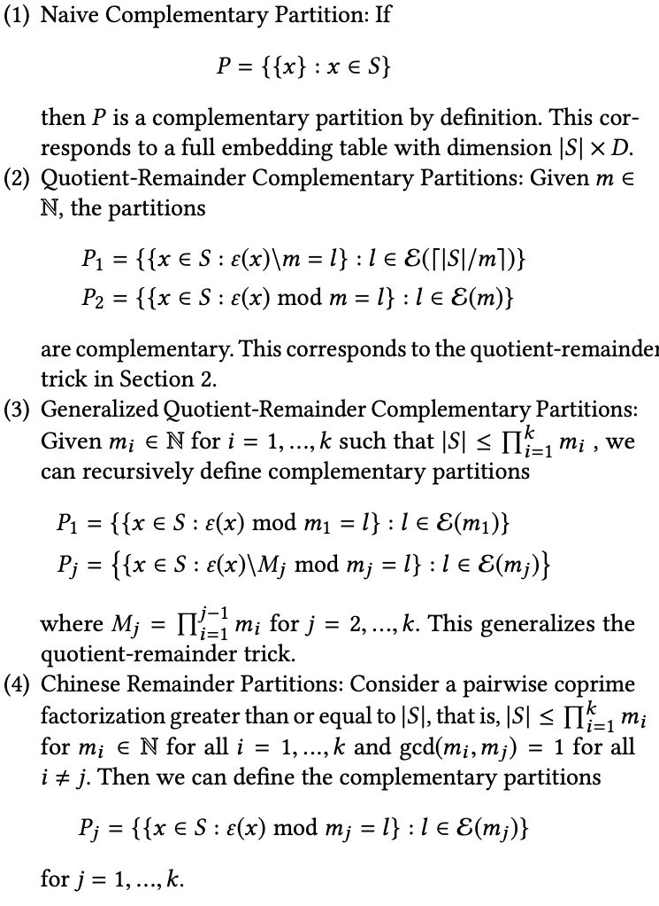

# Multi-Hash Variable
## 背景
在深度学习场景中，为了训练ID类的特征（例如user id或者item id），通常是将id类的稀疏特征映射到对应的低维稠密embedding向量中。在推荐场景中，随着数据量的逐渐增大，为每一个id类特征都存储一个对应的embedding向量是不现实的（例如商品数量的会达到10亿，embedding vector的维度是16，用float存储，存储量会达到64G）。因此在推荐场景中广泛使用基于Hash的方法，即对每个特征进行一次hash，然后再取获取对应的embedding，这样的方法的确可以减少内存的使用，但是由于存在hash冲突，不同的特征会被映射到同一个embedding向量，进而影响训练效果。
​

《Compositional Embeddings Using Complementary Partitions for Memory-Efficent Recommendation Systems》paper中提出了一种新的思路，在解决Embedding使用内存量大的问题同时还可以为每个特征分配一个单独的embedding vector，具体方法是：

1. 构造若干个小的Embedding table
1. 每个对应的table对应一个hash function， 这些hash function需要互补，即对于每一个id，他对应的hash值集合是唯一的，与其他任何一个id都不完全相同。例如当有两个embedding table的时候，使用Quotient-Reminder可以保证每个key都有唯一的hash集合，具体如下图：



3. 根据一定的策略将从多个table里取出来的embedding组合成最终的emebdding，例如add、multiply以及concat。
## Multi-Hash Variable
为了在DeepRec中提供上述的功能，我们在DeepRec实现了Multi-Hash Variable功能。目前可以通过`get_multihash_variable`接口来使用该功能，接口如下：
```python
def get_multihash_variable(name,
                           dims,
                           num_of_partitions=2,
                           complementary_strategy="Q-R",
                           operation="add",
                           dtype=float,
                           initializer=None,
                           regularizer=None,
                           trainable=None,
                           collections=None,
                           caching_device=None,
                           partitioner=None,
                           validate_shape=True,
                           use_resource = None,
                           custom_getter=None,
                           constraint=None,
                           synchronization=VariableSynchronization.AUTO,
                           aggregation=VariableAggregation.NONE):

#name: multihash variable的名字
#embedding dim：需要传入一个list， 如果list的长度是1，那么operation必须从add或mult中选择；
                如果list长度大于1，那么operation必须选择concat，同时list中的元素加起来长度要等于embedding_dim
#num_of_partions: variable的partition的数量。如果complementary_strategy为“Q-R”, 那么该
                  参数必须为2.
#complementary_strategy: 目前支持“Q-R”
#operation：从"add", "mult","concat中三选一
#intialier：与variable的相同
#partitioner：与variable的相同
```
目前只支持两个partition使用QR方法的多哈希，原因是根据paper中的实验，这种方法已经可以支持大部分的场景，同时超过三个partition的方法相对来说比较复杂，还会带来更多的lookup开销。
​

**使用示例：**
```python
import tensorflow as tf

def main(unused_argv):
  embedding = tf.get_multihash_variable("var-dist",
                                         [[2,2],[2,2]],
                                         complementary_strategy="Q-R",
                                         operation="concat",
                                         initializer=tf.ones_initializer)
  var = tf.nn.embedding_lookup(embedding, [0,1,2,3])
  fun = tf.multiply(var, 2.0, name='multiply')
  loss1 = tf.reduce_sum(fun, name='reduce_sum')
  opt = tf.train.AdagradOptimizer(0.1)
  g_v = opt.compute_gradients(loss1)
  train_op = opt.apply_gradients(g_v)
  init = tf.global_variables_initializer()

  with tf.Session() as sess:
       sess.run([init])
       print(sess.run([var, train_op]))

if __name__=="__main__":
  tf.app.run()
```
